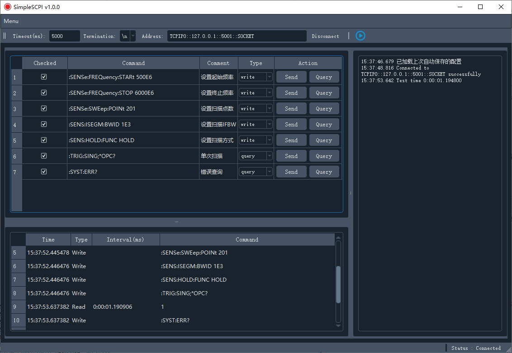

# SimpleSCPI


一个简单易用的 SCPI 仪器控制工具，基于 PyQt5 开发，提供图形界面来控制和测试 SCPI 兼容的测试仪器。

## 📸 界面预览



*SimpleSCPI 主界面 - 现代化的深色主题界面*

## ✨ 主要功能

- **多协议支持**：TCP/IP、USB、串口连接
- **命令管理**：可视化的 SCPI 命令编辑和管理
- **批量执行**：支持命令序列的批量执行
- **实时监控**：显示命令执行状态和响应时间
- **缓冲区管理**：一键清除仪器接收缓冲区
- **配置保存**：自动保存和恢复命令配置

## 🛠️ 环境安装

### 方法一：使用 Conda 环境（推荐）

1. **安装 Anaconda/Miniconda**
   - 下载并安装 [Anaconda](https://www.anaconda.com/products/distribution) 或 [Miniconda](https://docs.conda.io/en/latest/miniconda.html)

2. **创建并激活环境**
   ```bash
   # 使用项目提供的环境文件
   cd SimpleSCPI
   conda env create -f environment.yml
   conda activate simplescpi
   ```

### 方法二：使用 pip 安装

1. **安装 Python**
   - 确保已安装 Python 3.8 或更高版本

2. **创建虚拟环境**
   ```bash
   python -m venv venv
   
   # Windows:
   venv\Scripts\activate
   # macOS/Linux:
   source venv/bin/activate
   ```

3. **安装依赖**
   ```bash
   cd SimpleSCPI
   pip install -r requirements.txt
   ```

### 3. 安装 VISA 驱动

- **Windows**: 下载安装 [NI-VISA Runtime](https://www.ni.com/zh-cn/support/downloads/drivers/download.ni-visa.html)
- **Linux**: `sudo apt-get install libvisa-dev`
- **macOS**: 安装 NI-VISA 或使用 `pip install pyvisa-py`

## 🚀 快速开始

> 💡 **快速上手**：查看 [QUICKSTART.md](QUICKSTART.md) 获取最简单的安装和使用步骤。

### 运行程序

```bash
cd src
python main.py
```

## 📦 程序打包

使用 PyInstaller 将程序打包成独立的可执行文件：

```bash
# 安装 PyInstaller
pip install pyinstaller

# 打包程序
pyinstaller SimpleSCPI.spec
```

打包后的可执行文件位于 `dist/SimpleSCPI.exe`，可以在没有 Python 环境的计算机上直接运行。

## 📖 使用说明

### 1. 连接仪器
- 在工具栏输入仪器地址（如：`TCPIP0::192.168.1.100::5001::SOCKET`）
- 设置超时时间和终止符
- 点击 "Connect" 连接仪器

### 2. 管理命令
- **添加命令**：右键点击命令列表 → "Add Item"
- **编辑命令**：直接在表格中编辑
- **设置类型**：使用下拉框选择 Write 或 Query
- **删除命令**：右键 → "Delete Item"

### 3. 执行命令
- **单个执行**：点击 "Send" 或 "Query" 按钮
- **批量执行**：勾选命令，点击工具栏 "运行" 按钮

### 4. 查看结果
- 右侧面板显示实时 I/O 记录
- 左下角显示日志信息
- 使用 "Clear Buffer" 清除仪器缓冲区

## 📁 项目结构

```
SimpleSCPI/
├── src/
│   ├── main.py              # 程序入口
│   ├── core/                # 核心功能
│   │   ├── instrument.py    # 仪器控制
│   │   ├── base.py         # 基础类
│   │   └── exceptions.py   # 异常处理
│   ├── ui/                 # 用户界面
│   │   ├── main_window.py   # 主窗口逻辑
│   │   └── MainUI.py       # UI 定义
│   └── resources/          # 资源文件
├── images/                 # 项目截图
├── SimpleSCPI.spec         # PyInstaller 配置
├── requirements.txt        # Python 依赖
├── environment.yml         # Conda 环境配置
└── README.md              # 说明文档
```

## 🐛 常见问题

### 连接问题
- 确保仪器地址正确
- 检查网络连接或 USB 线缆
- 确认 VISA 驱动已正确安装

### 命令执行问题
- 检查命令语法是否正确
- 确认命令类型（Write/Query）设置正确
- 使用 "Clear Buffer" 清除残留数据

## 📄 许可证

本项目基于 MIT 许可证开源 - 查看 [LICENSE](LICENSE) 文件了解详情。

## 🤝 贡献

欢迎提交 Issue 和 Pull Request！

- 报告问题：[Issues](../../issues)
- 提交代码：[Pull Requests](../../pulls)

## 📞 联系

- 项目主页：[GitHub](https://github.com/Alen2013/SimpleSCPI)
- 问题反馈：[Issues](../../issues)

---

⭐ 如果这个工具对您有帮助，请给我们一个 Star！ 